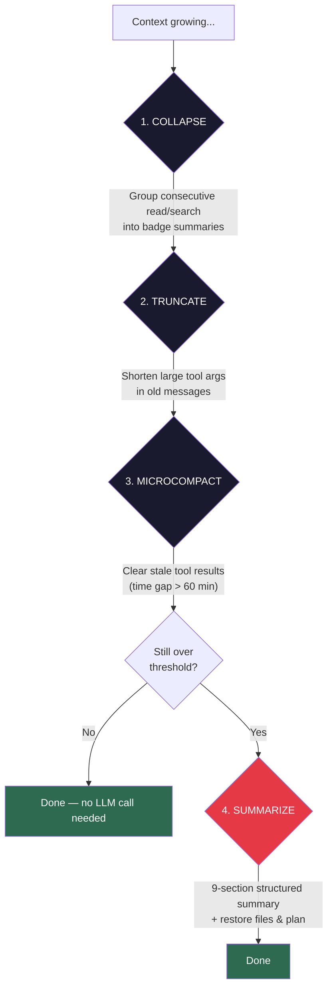

<h1 align="center">
  <br>
  <code>compact-middleware</code>
  <br>
</h1>

<h3 align="center">Claude Code's compaction engine, as a drop-in DeepAgents middleware.</h3>

<p align="center">
  <a href="LICENSE"></a>
  <a href="https://www.python.org/"></a>
  <a href="https://github.com/langchain-ai/deepagents"></a>
</p>

<p align="center">
  <a href="#the-problem">Problem</a> &bull;
  <a href="#how-it-works">How it works</a> &bull;
  <a href="#quick-start">Quick start</a> &bull;
  <a href="#configuration">Configuration</a> &bull;
  <a href="#comparison">Comparison</a>
</p>

---

Long-running AI agents hit the context window wall. The built-in `SummarizationMiddleware` does a single-pass summary with a generic prompt — it works, but it loses critical details and has no lightweight fallbacks.

**compact-middleware** takes the battle-tested compaction pipeline from [Claude Code](https://docs.anthropic.com/en/docs/claude-code) and makes it a composable [DeepAgents](https://github.com/langchain-ai/deepagents) middleware. One import, and your agents handle **10x longer conversations** without blowing the context window.

---

## The Problem

| What goes wrong | Built-in middleware | compact-middleware |
|---|---|---|
| Summary loses file paths, code, user feedback | Generic prompt | **9-section structured prompt** |
| Every compaction = expensive LLM call | Yes | **3 free levels tried first** |
| Recently-read files vanish after compaction | Yes | **Auto-restores top 5 files + active plan** |
| Compaction fails and retries forever | Yes | **Circuit breaker after 3 failures** |
| No way to clear stale tool results cheaply | Correct | **Time-based microcompaction (free)** |
| Token counting is pure heuristic | Yes | **Hybrid: real API usage + heuristic tail** |

---

## How It Works

The middleware runs a **multi-level cascade** — cheapest fix first, LLM call only if needed:



> Levels 1-3 are **free** (no LLM call). In many cases they're enough to stay within budget.

---

## Quick Start

### Install

```bash
# From source (not yet on PyPI)
pip install git+https://github.com/emanueleielo/compact-middleware.git

# Or local development
git clone https://github.com/emanueleielo/compact-middleware.git
cd compact-middleware
pip install -e ".[dev]"
```

### Minimal — zero config

```python
from deepagents import create_deep_agent
from compact_middleware import CompactionMiddleware, CompactionToolMiddleware

mw = CompactionMiddleware(
    model="anthropic:claude-sonnet-4-6",
    backend=backend,
)
tool_mw = CompactionToolMiddleware(mw)  # optional: lets the agent compact manually

agent = create_deep_agent(
    model="anthropic:claude-sonnet-4-6",
    tools=[read_file, edit_file, execute],
    system_prompt="You are a coding assistant.",
    backend=backend,
    middleware=[mw, tool_mw],
)

# That's it — compaction triggers automatically at ~85% context usage
result = agent.invoke({"messages": [("human", "Refactor the auth module")]})
```

### With `create_deep_agent` — full setup

```python
from deepagents import create_deep_agent
from deepagents.backends import FilesystemBackend
from langchain.chat_models import init_chat_model

from compact_middleware import (
    CompactionConfig,
    CompactionMiddleware,
    CompactionToolMiddleware,
)

backend = FilesystemBackend(root_dir="/data/workspace")
model = init_chat_model("anthropic:claude-sonnet-4-6")

mw = CompactionMiddleware(model=model, backend=backend)
tool_mw = CompactionToolMiddleware(mw)

agent = create_deep_agent(
    model=model,
    tools=[search_tool, execute_tool, edit_file_tool],
    system_prompt="You are a senior engineer.",
    backend=backend,
    middleware=[mw, tool_mw],
    memory=["/memory/AGENTS.md"],
    interrupt_on={"edit_file": True},
)

# Async works too — all operations have async variants
result = await agent.ainvoke({"messages": [("human", "Add pagination to the API")]})
```

---

## Configuration

The defaults match Claude Code's production settings. Override what you need:

### Custom triggers and budgets

```python
from compact_middleware import CompactionConfig, CompactionMiddleware
from compact_middleware.config import (
    CollapseConfig,
    MicrocompactConfig,
    RestorationConfig,
    TokenBudgetConfig,
    TruncateArgsConfig,
)

config = CompactionConfig(
    # --- When to compact ---
    trigger=("fraction", 0.80),          # at 80% of context window (default: 0.85)
    keep=("messages", 10),               # keep last 10 messages after compaction

    # --- Circuit breaker ---
    max_consecutive_failures=5,          # default: 3

    # --- Custom summary instructions ---
    custom_instructions="Focus on code diffs and test output. Include file paths verbatim.",
    suppress_follow_up_questions=True,   # resume without asking "where were we?"
)

mw = CompactionMiddleware(model=model, backend=backend, config=config)
```

### Microcompaction (free tool result clearing)

```python
config = CompactionConfig(
    microcompact=MicrocompactConfig(
        enabled=True,                       # default
        gap_threshold_minutes=30,           # clear after 30 min gap (default: 60)
        keep_recent=3,                      # always keep last 3 results (default: 5)
        compactable_tools={                 # which tools' results can be cleared
            "read_file", "execute", "grep", "glob",
            "web_search", "web_fetch", "edit_file", "write_file",
        },
    ),
)
```

### Argument truncation

```python
config = CompactionConfig(
    truncate_args=TruncateArgsConfig(
        trigger=("fraction", 0.80),         # when to start truncating
        max_length=1_000,                   # chars per arg value (default: 2000)
        truncate_all_tools=True,            # all tools, not just write/edit (default)
    ),
)
```

### Message collapsing

```python
config = CompactionConfig(
    collapse=CollapseConfig(
        enabled=True,
        min_group_size=3,                   # need 3+ consecutive reads to collapse (default: 2)
        collapse_tools={"read_file", "grep", "glob", "web_search"},
    ),
)
```

### Post-compaction restoration

```python
config = CompactionConfig(
    restoration=RestorationConfig(
        enabled=True,
        max_files=3,                        # re-read top 3 recent files (default: 5)
        file_budget_chars=30_000,           # total budget for restored content
        per_file_chars=10_000,              # max per file
        restore_plans=True,                 # re-attach active plan state
    ),
)
```

### Token budgets

```python
config = CompactionConfig(
    token_budget=TokenBudgetConfig(
        per_tool_chars=50_000,              # max chars per tool result
        per_message_chars=200_000,          # aggregate max per message turn
    ),
)
```

### Trigger formats

The `trigger` and `keep` parameters accept three formats:

```python
# Absolute token count
trigger=("tokens", 170_000)

# Fraction of context window (requires model with known context size)
trigger=("fraction", 0.85)

# Message count
trigger=("messages", 50)

# Multiple triggers (any fires)
trigger=[("fraction", 0.85), ("messages", 100)]
```

---

## Comparison

| Feature | `SummarizationMiddleware` | **`compact-middleware`** |
|---|:---:|:---:|
| Summary prompt | Generic | 9-section structured |
| Pre-summarization optimization | &mdash; | Collapse + Truncate + Microcompact |
| Partial compaction (prefix/suffix) | &mdash; | Yes |
| Post-compaction restoration | &mdash; | Files + Plans |
| Circuit breaker | &mdash; | Configurable |
| PTL error recovery | &mdash; | Head truncation + retry |
| Token counting | Heuristic only | Hybrid (real API + heuristic) |
| Argument truncation | `write_file`, `edit_file` | All tools |
| Time-based clearing | &mdash; | Configurable gap threshold |
| Message collapsing | &mdash; | Consecutive read/search |
| Custom summary instructions | &mdash; | Yes |
| Async support | Yes | Yes (concurrent offload + summary) |

---

## The 9-Section Summary Prompt

Unlike a generic "summarize this conversation", the compaction prompt enforces 9 sections that preserve what agents actually need:

1. **Primary Request & Intent** — what the user asked for
2. **Key Technical Concepts** — frameworks, patterns, technologies
3. **Files & Code Sections** — paths, snippets, _why_ they matter
4. **Errors & Fixes** — what broke and how it was resolved
5. **Problem Solving** — debugging strategies and troubleshooting
6. **All User Messages** — verbatim non-tool messages (catches intent drift)
7. **Pending Tasks** — what's still open
8. **Current Work** — exactly where things left off
9. **Optional Next Step** — with direct quotes to prevent task drift

An `<analysis>` scratchpad is used during generation for quality, then stripped from the final summary.

---

## Hybrid Token Counting

Most middleware estimates tokens with `len(text) / 4`. That's a guess.

**compact-middleware** uses a hybrid approach ported from Claude Code:

```
Messages: [Human] [AI] [Tool] [AI with usage={input:45000, output:1200}] [Human] [AI]
                                              ^                              ^      ^
                                       real: 46,200 tokens               heuristic only
                                       (from API response)               (for these 2)
```

It walks messages backwards, finds the last `AIMessage` with real API token usage (`response_metadata.usage`), and estimates only the messages after it. Falls back to pure heuristic when no API response is available.

Works with Anthropic, OpenAI, and any LangChain-compatible provider.

---

## Architecture

```
compact_middleware/
├── middleware.py      CompactionMiddleware + CompactionToolMiddleware
├── decision.py        Multi-level cascade engine
├── compaction.py      LLM summarization (full + partial)
├── tokens.py          Hybrid token counting (real API + heuristic)
├── prompts.py         9-section prompt templates
├── microcompact.py    Time-based tool result clearing
├── collapse.py        Message collapsing
├── truncation.py      Argument truncation
├── restoration.py     Post-compaction file/plan restoration
├── config.py          All configuration dataclasses
└── state.py           State schema (TypedDict events)
```

## Development

```bash
git clone https://github.com/emanueleielo/compact-middleware
cd compact-middleware
pip install -e ".[dev]"

pytest -v              # run tests
ruff check .           # lint
mypy compact_middleware # typecheck
```

## License

[MIT](LICENSE)
